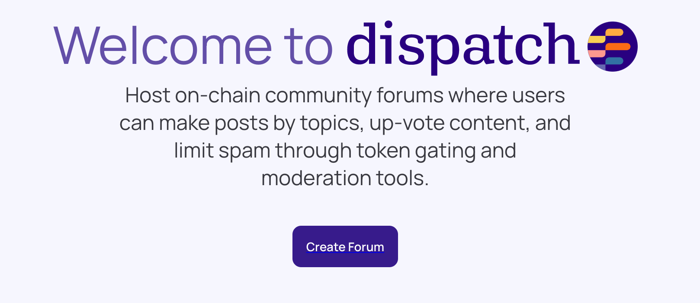
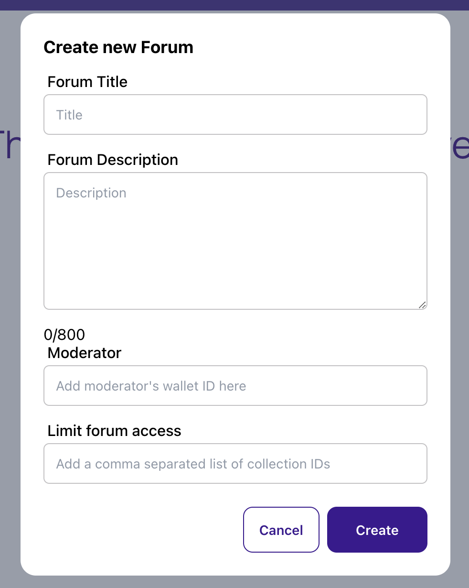
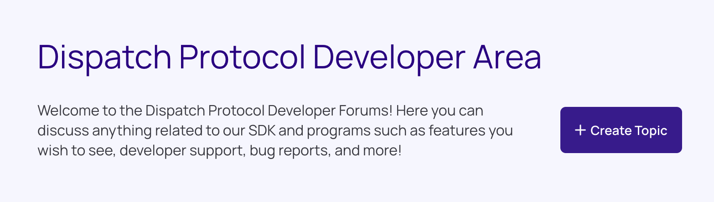

# Getting Started with Dispatch Forums

Go to Solana Beach or a mountain top in the Metaverse. Next, meditate on what your community is going to be about and why people would want to join. Once you’ve done that, the rest is a piece of cake. Have we mentioned already that no coding is required? 

## Launch your Dispatch Forum

📌 Have ready the name and short description of your community, your moderators’ wallet addresses, and Collection ID (if you are token gating by NFT collection).

📌 Your Collection ID, also referred to as Collection Mint ID, is the mint ID of the collection NFT. To learn more about Collection IDs, see Metaplex’s [docs](https://docs.metaplex.com/programs/token-metadata/certified-collections/).

1. Like any Solana app, connect your wallet by clicking the connect button in the upper right. 
2. Go to the Dispatch forum [app](https://app.dispatch.forum/) and click “Create Forum”.
    
    
    
3. Give your Forum a title, like the name of your NFT Community, which I’m hoping is Boring Bananas with your rival community being Aggressive Avocados (which food source has the most potassium?!). Provide a description, limit 800 characters, too. 
    
    
    
4. Next add your moderator’s wallet address. You have the option to add more moderators later. Because your wallet is creating the community, it will also have the same privileges as moderators. 
5. Finally, if you are token gating your community, provide your Collection ID in the “Limit Forum Access” field. You can input multiple Collection IDs using comma separation. If you do this, users with NFTs from either collection will be able to write to your forum. If you aren’t token gating, feel free to skip this step. 
6. When you are done, click **Create** to launch your forum. This action writes the creation of your forum to the Solana blockchain. 
7. Your forum is ready and you can start creating topics. Click the “Create Topic” button. If you set up token gating, only wallets with your token will be able to create a topic. 
    
    
    

<aside>
📌 Solana is working on a feature that allows encrypted data to be stored on chain. Once this is done, you will have the option to make your forum private to wallets holding your token. 

If you are currently token gating, only wallets holding your token can make posts, however anyone can see the posts since the Solana blockchain is public.

</aside>

Next, [Create Engagement with Dispatch](Create%20Engagement%20with%20Dispatch) >